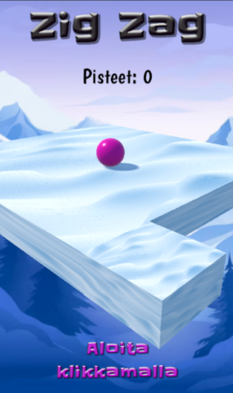

# ZigZag Game

Unitylla ja C#:lla toteutettu pieni ZigZag-peli, tarkoitettu pelattavaksi mobiililaitteella.

## Tekniikat
- Unity
- C#
- Visual Studio

## Kuvaus
Pelaaja liikkuu siksak-reittiä pitkin. Tarkoitus on pysyä reitillä mahdollisimman pitkään.

## Projekti
Repo sisältää pelin lähdekoodin. Koodi löytyy erityisesti Assets/Scripts/ -kansiosta.  

## Screenshot

